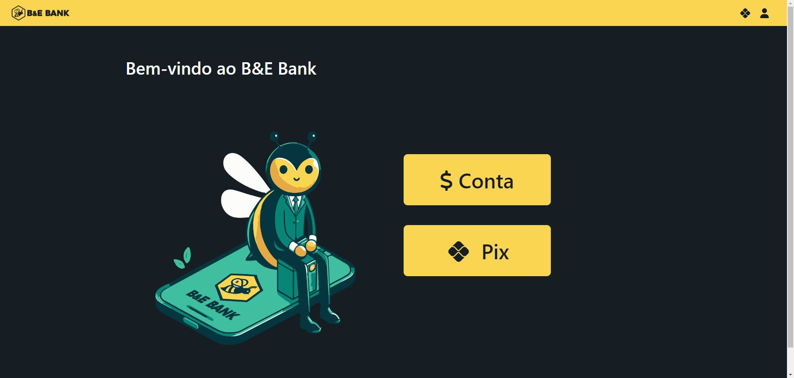
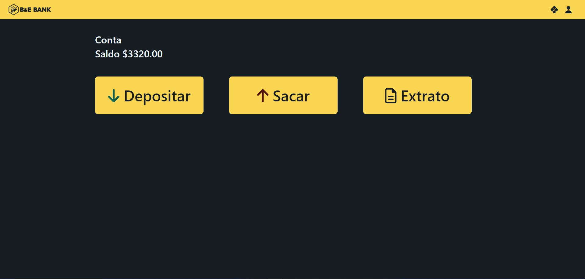
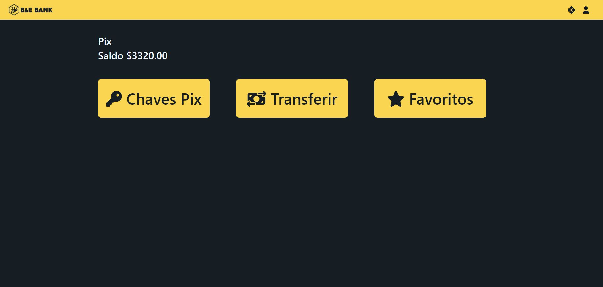
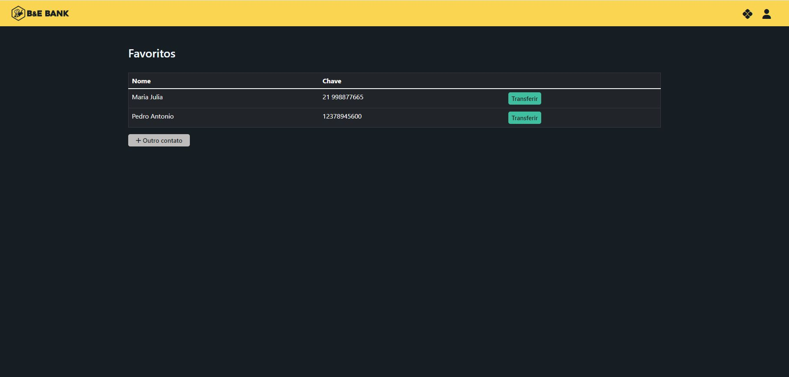
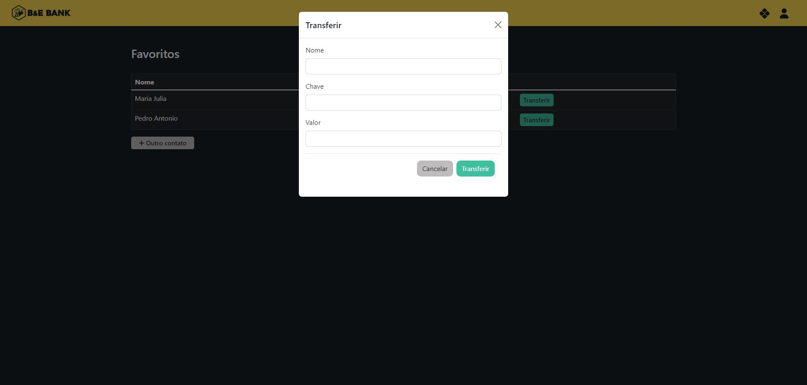

[HTML_BADGE]: https://img.shields.io/badge/html5-%23E34F26.svg?style=for-the-badge&logo=html5&logoColor=white
[CSS_BADGE]: https://img.shields.io/badge/css3-%231572B6.svg?style=for-the-badge&logo=css3&logoColor=white
[PHP_BADGE]: https://img.shields.io/badge/php-%23777BB4.svg?style=for-the-badge&logo=php&logoColor=white
[MYSQL_BADGE]: https://img.shields.io/badge/mysql-4479A1.svg?style=for-the-badge&logo=mysql&logoColor=white
[PROJECT__BADGE]: https://img.shields.io/badge/📱Visit_this_project-000?style=for-the-badge&logo=project
[PROJECT__URL]: https://brunaciarlo.github.io/lojaFunko/

<h1 align="center" style="font-weight: bold;"> 🐝 Bee bank 💵 </h1>

🌐 <a href="#ingles"> _English README </a> below the portuguese_

![HTML_BADGE]
![CSS_BADGE]
![PHP_BADGE]
![MYSQL_BADGE]

<p align="center">
  <a href="#sobre">Sobre</a> • 
  <a href="#comecando">Começando</a>
</p>

<p align="center">
  
  
  
  
  
  
</p>

<h2 id="sobre">📖 Sobre</h2>

Nesse projeto foi criado um sistema de simulação de uma conta bancária. Como requisito do projeto, era necessário implementar
os módulos conta e pix.

Dentro do módulo conta existem as operações de realizar um depósito, realizar saque e verificar o extrato.
Dentro do módulo pix existem as operações de cadastro e remoção de chave pix (do tipo telefone e CPF) e listagem das chaves
cadastradas e envio de pix para contatos favoritos cadastrados ou outros, inserindo nome e chave na hora da transação. Ao
inserir esses dados, o contato salva na lista de favoritos.

Além dessas funcionalidades, as validações exigidas foram: não aceitar campos vazios e validar máscara de CPF e telefone.

<h4>🔒 Importante!</h4>
Ao rodar esse projeto no seu computador, as informações inseridas são salvas apenas no banco de dados local.
 É completamente seguro inserir dados reais ou fictícios no site.

<h4>📚 Estudo</h4>
Esse projeto é uma aplicação para estudo de desenvolvimento web front-end exigida da disciplina de Programação Web.

<h2 id="comecando">🚀 Começando</h2>

Por falta de recursos para hospedar um projeto em PHP com banco de dados, é necessário baixar o projeto e rodar na sua máquina
 para poder visualiza-lo funcionando, para isso, siga os passos a seguir:

<h3>Pré-requisitos</h3>

- [XAMPP](https://www.apachefriends.org/pt_br/index.html) (ou ambiente alternativo de desenvolvimento PHP e SQL)

<h3>Clonando</h3>

Como clonar

```bash
git clone https://github.com/brunaciarlo/BeeBank.git
```

Mover (caso ainda não esteja) a pasta do projeto clonado para dentro da pasta `htdocs`, no XAMPP

Iniciar `Apache` e `MySQL` no XAMPP

Acessar http://localhost/phpmyadmin/ no navegador (ou clicar no botão `Admin` no XAMPP ao lado do MySQL)

Exportar o arquivo `bee_bank.sql` que está dentro da pasta `db` do projeto clonado

Acessar http://localhost/beebank/ no navegador

---------------------------------------------------------------------------------------------------------------------------------------

<h1 id="ingles" align="center" style="font-weight: bold;">🐝 Bee bank 💵</h1>

![HTML_BADGE]
![CSS_BADGE]
![PHP_BADGE]
![MYSQL_BADGE]

<p align="center">
  <a href="#about">About</a> • 
  <a href="#starting">Getting Started</a>
</p>

<p align="center">
  
  
  
  
  
  
</p>

<h2 id="about">📖 About</h2>

In this project it was created a bank account simulation's system. As a project requirement, it was necessary to implement the modules "account" and "pix*".

Within the "account" module, there are operations to make a deposit, withdraw funds, and check the statement.
Within the "pix" module, there are operations for registering and removing pix keys (such as phone number and CPF), listing registered keys, and sending pix to
registered favorite contacts or others, entering name and key at the time of the transaction. When entering this data, the contact is saved in the favorites list.

In addition to these functionalities, the required validations were: not accepting empty fields and validating CPF and phone number masks.

*PIX is a Brazilian instant payment system introduced by the Central Bank of Brazil. It enables individuals and businesses to make real-time payments 24/7, including weekends and holidays, using various identifiers and 
it is processed almost instantly.

<h4>🔒 Important!</h4>
When running this project on your computer, the information entered is only saved in the local database. It is completely safe to enter real or fictitious data on the website.

<h4>📚 Study</h4>
This project is an apliccation with the purpose of front-end development study for "Web Programming" subject.

<h2 id="starting">🚀 Getting Started</h2>

Due to a lack of resources to host a PHP project with a database, it is necessary to download the project and run it on your machine in order to view it in operation. To do this, follow the steps below:

<h3>Pré-requisitos</h3>

- [XAMPP](https://www.apachefriends.org/pt_br/index.html) (or an alternative environment to run PHP and SQL)

<h3>Clonando</h3>

How to clone

```bash
git clone https://github.com/brunaciarlo/BeeBank.git
```

Move (in case it isn't yet) the project cloned folder into the `htdocs` directory in XAMPP

Start `Apache` and `MySQL` in XAMPP

Access http://localhost/phpmyadmin/ in the browser (or click `Admin` in XAMPP next to MySql)

Export the file `bee_bank.sql` which is in `db` folder, within the cloned project

Access http://localhost/beebank/ in the browser
